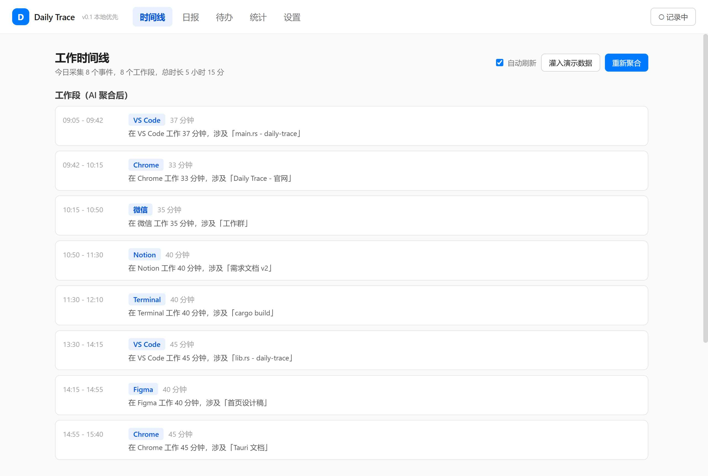
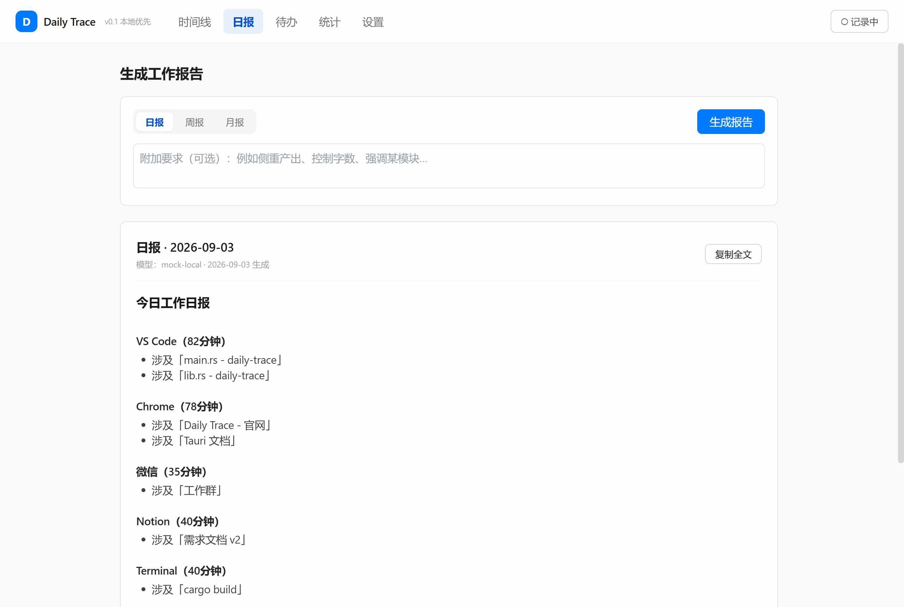
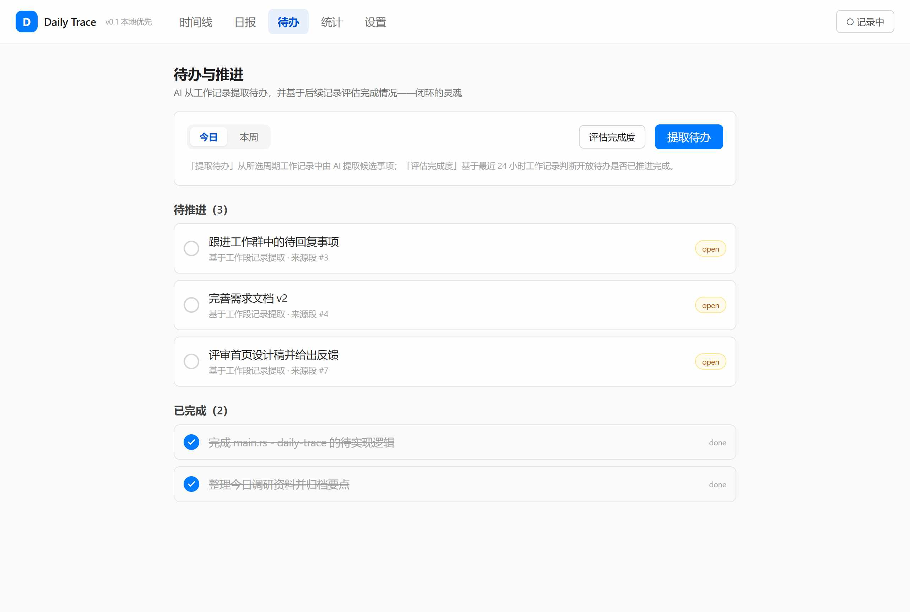
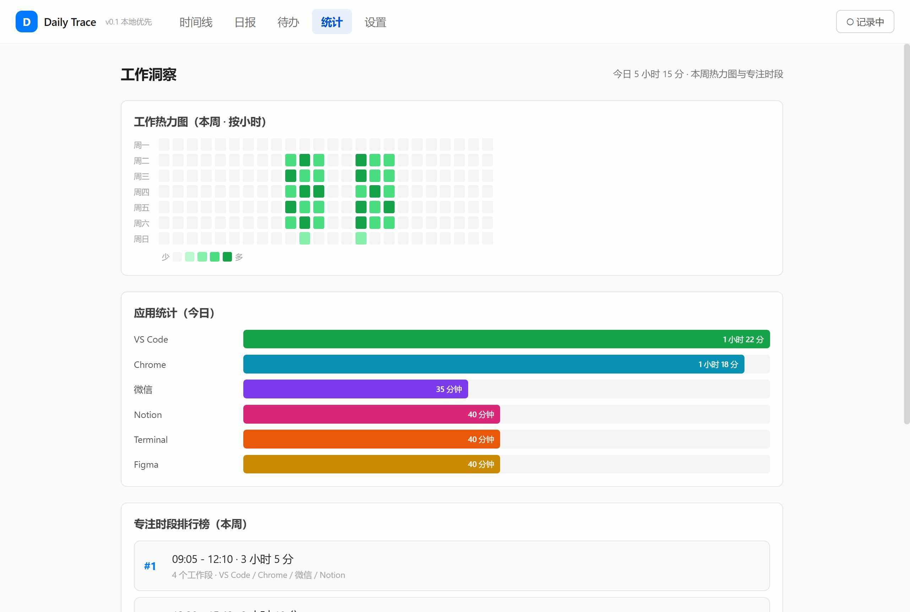
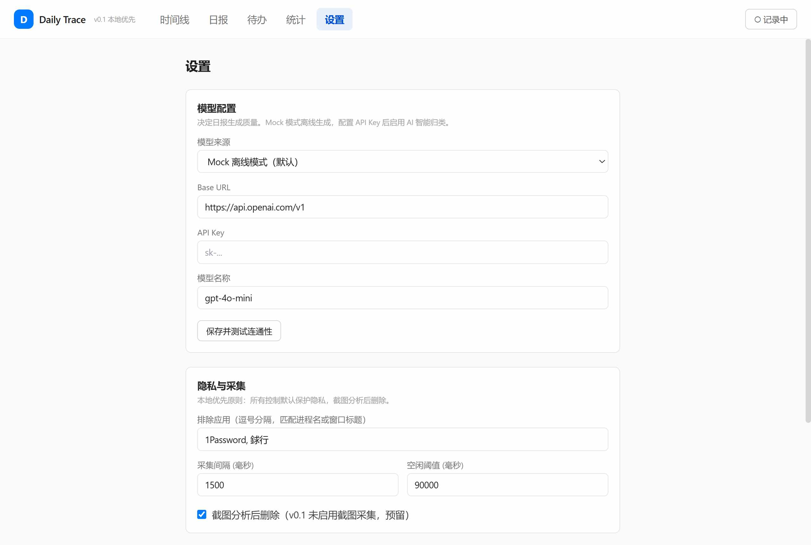

# Daily Trace

> 本地优先的 AI 工作记忆与复盘助手 — 自动采集工作轨迹 → 聚合为工作段 → 生成日/周/月报 → 提取待办 → 基于记录评估完成，形成完整闭环。

按 `docs/SPEC.md` 实现，当前 **v0.2**：核心闭环（采集→聚合→日报）+ 待办提取与完成评估回环 + 工作洞察（热力图/专注时段/词云）+ 系统托盘。



---

## 核心闭环

```
采集  →  聚合  →  日报  →  提取待办  →  基于记录评估完成
  ↑                                                    │
  └──────────── 闭环回写（后续 Lobster API/Agent）──────┘
```

不只是写一篇日报，而是把工作真正沉淀为成果并推动下一步。

---

## 功能特性

**采集与理解**
- Windows 前台应用活动采集（进程名 + 窗口标题 + 停留时长），事件触发式（前台变化才写库，省存储）
- 事件聚合为工作段（同 app 连续合并、空闲切断，幂等可重入）
- SQLite 本地存储 + 7 张表 + 内置默认分类与日报模板

**报告生成**
- 日 / 周 / 月报一键生成，Markdown 渲染 + 历史归档 + 单条删除 / 清空
- LLM Provider 双源：OpenAI 兼容云模型 + 离线 Mock（无 Key 也可体验闭环）



**待办与回环（闭环灵魂）**
- AI 从工作段提取候选待办（mock 按 app 规则生成，云模型智能提取）
- 基于最近 24 小时工作记录评估开放待办是否已推进完成，自动更新状态
- 待推进 / 已完成分组，点击标记，来源段可追溯



**工作洞察**
- 工作热力图（本周 7 天 × 24 小时，5 级色阶，hover 显示时长）
- 专注时段排行榜（连续段合并，按时长降序，含涉及 app）
- 工作词云（高频窗口标题词，字号映射频率）
- 应用统计（今日各 app 时长条形图）



**体验与隐私**
- 系统托盘：关闭按钮最小化到右下角（不退出，采集守护进程继续运行），托盘左键恢复 / 右键退出
- 隐私控制：暂停记录 / 排除敏感应用 / 截图分析后删除（预留）/ 本地优先默认不上云
- 模型管理：云 API + 自定义接口（OpenAI 兼容）+ 本地 Ollama + Mock，设置页可配 + 连通性测试




---

## 技术栈

| 层 | 选型 |
|---|---|
| 桌面壳 | Tauri 2 (Rust + WebView2 + tray-icon) |
| 后端 | Rust（采集 / 聚合 / Provider / 报告 / 待办 / 洞察） |
| 存储 | SQLite (rusqlite，本地优先) |
| 前端 | React 18 + TypeScript + Vite + Tailwind |
| AI | OpenAI 兼容协议 + 离线 Mock |
| CI | GitHub Actions (windows-latest) |

---

## 快速开始

### 方式一：直接下载 release exe（推荐，免环境）

到 [Actions 构建页](https://github.com/skyone123/daily-trace/actions) 选最新一次 run，底部 Artifacts 下载 `daily-trace-windows-exe`，解压双击 `daily-trace.exe` 即可（Win11 自带 WebView2）。

### 方式二：本地开发模式

需 Rust 1.77+ / Node 20+ / MSVC Build Tools：

```powershell
git clone https://github.com/skyone123/daily-trace.git
cd daily-trace
npm install
npm run tauri dev
```

首次编译约 3–5 分钟，窗口自动弹出。改代码热重载。

### 方式三：离线验证闭环（不开 GUI）

```powershell
cd src-tauri
cargo run --example cli_demo      # 日报闭环：采集→聚合→日报
cargo run --example todo_demo     # 待办闭环：提取待办→评估完成
```

---

## GitHub Actions 自动构建

仓库已配 `.github/workflows/build.yml`，push 到 main 自动触发 Windows release 构建，上传 exe artifact。

拿新 exe（本地）：
```powershell
gh run list                              # 找最新 run id
gh run download <run-id> --name daily-trace-windows-exe --dir release-output
```

或本地打包：
```powershell
npm run tauri build      # 产物 src-tauri/target/release/daily-trace.exe
```

---

## 配置云模型（获得 AI 智能日报）

默认离线 Mock（结构化日报，不调云、不花 token）。设置 Tab → 模型来源选「OpenAI 兼容云模型」→ 填三项 → 保存并测试连通性，即时生效无需重启。

| 服务 | Base URL | 模型名示例 |
|---|---|---|
| OpenAI | `https://api.openai.com/v1` | `gpt-4o-mini` |
| DeepSeek | `https://api.deepseek.com/v1` | `deepseek-chat` |
| 通义千问 | `https://dashscope.aliyuncs.com/compatible-mode/v1` | `qwen-plus` |
| 豆包 | `https://ark.cn-beijing.volces.com/api/v3` | `doubao-pro` |

API Key 仅存本地 SQLite，不入代码库，不上传 GitHub。

---

## 项目结构

```
daily-trace/
├─ docs/                SPEC.md / sample-report.md / UI 截图
├─ .github/workflows/   Actions 构建 Windows exe
├─ src/                 前端 React
│  ├─ App.tsx           5 Tab 框架 + 暂停控制
│  ├─ lib.ts            Tauri IPC 封装 + 类型 + mock 数据
│  └─ components/       Timeline / ReportView / TodosView / StatsView / SettingsView / Markdown
├─ src-tauri/
│  ├─ src/
│  │  ├─ lib.rs         入口（setup + 托盘 + 命令注册 + 采集循环）
│  │  ├─ store.rs       SQLite schema + 数据访问（含 todo/report CRUD）
│  │  ├─ capture.rs     采集 trait + Windows 前台采集 + Mock 源
│  │  ├─ aggregator.rs  事件聚合算法（幂等）
│  │  ├─ llm.rs         Provider（OpenAI 兼容 + 离线 Mock 日报生成）
│  │  ├─ report.rs      报告生成 + 模型构造
│  │  ├─ todo.rs        待办提取 + 完成评估回环
│  │  ├─ stats.rs       热力图 / 专注时段 / 词云计算
│  │  ├─ commands.rs    Tauri 命令层（20 个命令）
│  │  └─ state.rs       全局 AppState
│  └─ examples/         cli_demo.rs / todo_demo.rs（闭环验证）
```

---

## 隐私设计

本地优先是核心卖点。默认配置 = 最大隐私：

- 工作记录与报告默认存本地 SQLite，可导出 / 备份 / 清理
- 云模型、同步等上云能力默认关闭，由用户显式开启
- 采集范围精细可控：暂停记录 / 排除敏感应用（进程名或标题匹配）/ 选择显示器 / 关闭详细上下文
- API Key 仅本地存储，不进代码库

---

## 路线图

**已完成**
- v0.1：采集 → 聚合 → 日/周/月报 → 时间线 → 应用统计 → 隐私控制 → 模型管理 → 内部 IPC 骨架
- v0.2：待办提取 + 完成评估回环 → 热力图 / 专注时段 / 词云 → 系统托盘 → 历史报告清理

**规划中（按 SPEC）**
- v0.3：Lobster 对外 HTTP API + Agent 读写接入 → 可视化报告 + 网页对话 → 模型网页账号接入 → 多模态视觉 fallback
- v1.0：截图采集 + 本地 OCR → 微信小程序 → 跨设备同步（可选）
- v2.0：团队协作版（独立产品线）

详见 `docs/SPEC.md`（16 章 + 设计决策已锁定）。

---

## 文档

- [SPEC.md](docs/SPEC.md) — 产品规格说明书（完整设计 + 数据模型 + 决策）
- [sample-report.md](docs/sample-report.md) — 日报样本

---

## 相关

- 学习复刻项目，从零实现，不包含任何第三方代码或专有资源。
